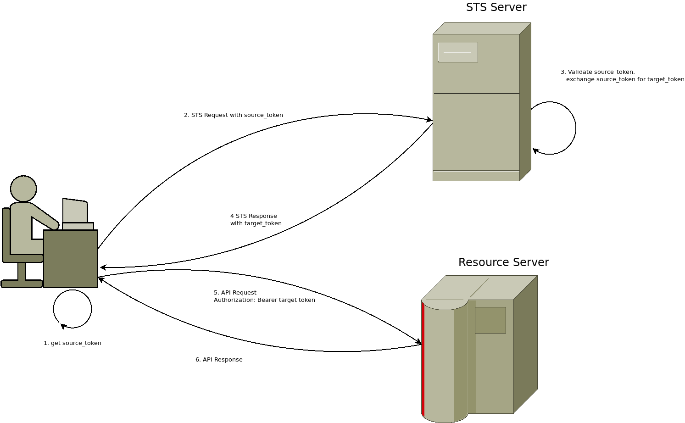

##  Security Token Service (STS) Credentials for HTTP and gRPC (rfc8693)


This library provides `HTTP` and `gRPC` credentials where the final `access_token` is acquired through [STS OAuth 2.0 Token Exchange:  rfc8693](https://www.rfc-editor.org/rfc/rfc8693) 


You can use this library to setup sts credentials for use with either `net/http` Client or  gRPC `RPCCredentials` where you exchange an intermediate credential with an STS server for a final `access_token`.   The final token is then used to access the resource server


see `examples/` folder




---

##### References

* [Serverless Security Token Exchange Server(STS)](https://github.com/salrashid123/sts_server)
* [Certificate Bound Tokens using Security Token Exchange Server (STS)](https://github.com/salrashid123/cert_bound_sts_server)


---

### HTTP


```golang
import (
	stshttp "github.com/salrashid123/sts/http"
)


	rootTS := oauth2.StaticTokenSource(&oauth2.Token{
		AccessToken: secret,
		TokenType:   "Bearer",
		Expiry:      time.Now().Add(time.Duration(time.Second * 60)),
	})

	// HTTP
	stsTokenSource, _ := stshttp.STSTokenSource(
		&stshttp.STSTokenConfig{
			TokenExchangeServiceURI: *stsaddress,
			Resource:                *stsaudience,
			Audience:                *stsaudience,
			Scope:                   *scope,
			SubjectTokenSource:      rootTS,
			SubjectTokenType:        "urn:ietf:params:oauth:token-type:access_token",
			RequestedTokenType:      "urn:ietf:params:oauth:token-type:access_token",
			HTTPClient:              http.DefaultClient,
		},
	)

	tok, err := stsTokenSource.Token()
	log.Printf("New Token: %s", tok.AccessToken)

	client := oauth2.NewClient(context.TODO(), stsTokenSource)
	resp, err := client.Get(*httpAddress)
```

---

### gRPC

Note that upstream [google.golang.org/grpc/credentials/sts](https://pkg.go.dev/google.golang.org/grpc/credentials/sts) provides the same credential object except that this variation allows for


* arbitrary HTTPClients  [issue #5611](https://github.com/grpc/grpc-go/pull/5611)

* allowing source tokens from arbitrary `oauth2.TokenSource`:

```golang
	// token source for the subject token
	SubjectTokenSource *oauth2.TokenSource
```    


Example usage:

```golang
import (
	stsgrpc "github.com/salrashid123/sts/grpc"
)


	rootTS := oauth2.StaticTokenSource(&oauth2.Token{
		AccessToken: secret,
		TokenType:   "Bearer",
		Expiry:      time.Now().Add(time.Duration(time.Second * 60)),
	})

	ce := credentials.NewTLS(&tls.Config{})

	// ### test with sts
	stscreds, err := stsgrpc.NewCredentials(stsgrpc.Options{
		TokenExchangeServiceURI: *stsaddress,
		Resource:                *stsaudience,
		Audience:                *stsaudience,
		Scope:                   *scope,
		SubjectTokenSource:      &rootTS,
		SubjectTokenType:        "urn:ietf:params:oauth:token-type:access_token",
		RequestedTokenType:      "urn:ietf:params:oauth:token-type:access_token",
		HTTPClient:              http.DefaultClient,
	})

	ctx := context.Background()

	conn, err := grpc.Dial(*grpcAddress,
		grpc.WithTransportCredentials(ce),
		grpc.WithPerRPCCredentials(stscreds))

	defer conn.Close()
	c := pb.NewEchoServerClient(conn)

	r, err := c.SayHello(ctx, &pb.EchoRequest{Name: "unary RPC msg "})

```
